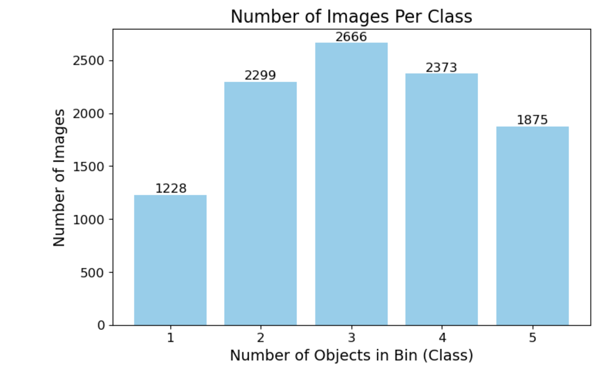

# Project Proposal

## **Domain Background**

Distribution centers like Amazon Fulfillment Centers process millions of products daily. Accurate inventory tracking is critical to ensure operational efficiency, minimize errors, and enhance customer satisfaction. This project focuses on utilizing **computer vision and metadata** to classify bin images based on the number of objects they contain, streamlining inventory management.

## **Problem Statement**

Inventory tracking in distribution centers often requires manual or semi-automated processes that are time-consuming and error-prone. The goal of this project is to automate the classification of bin images into five categories (1–5 objects) using computer vision, improving inventory accuracy, reducing manual effort, and enhancing operational efficiency.

## **Solution Statement**

This project develops three machine learning models:

1. **Benchmark Model**: ResNet50, a robust and pre-trained convolutional neural network, fine-tuned for multi-class classification.
2. **Simple Model**: A custom-designed lightweight model with reduced complexity for faster inference.
3. **Tuned Model**: A hyperparameter-optimized version of ResNet50 using techniques such as grid search and SageMaker HPO tools.

All models classify bin images based on the number of objects (1–5) and leverage AWS SageMaker for training, validation, and deployment. A JSON dataset is used to map images to their `EXPECTED_QUANTITY` for accurate labeling.

## **Datasets and Inputs**

The dataset comprises:

1. **Images**: Bin images obtained from the **Amazon Bin Image Dataset**.


2. **Metadata**: JSON files accompanying the images provide details like `EXPECTED_QUANTITY`, dimensions, and weight of items in the bins.

[Example Json Data](https://aft-vbi-pds.s3.amazonaws.com/metadata/523.json)

```json
{
    "BIN_FCSKU_DATA": {
        "B000A8C5QE": {
            "asin": "B000A8C5QE",
            "height": {
                "unit": "IN",
                "value": 4.200000000000001
            },
            "length": {
                "unit": "IN",
                "value": 4.7
            },
            "name": "MSR PocketRocket Stove",
            "quantity": 1,
            "weight": {
                "unit": "pounds",
                "value": 0.45
            },
            "width": {
                "unit": "IN",
                "value": 4.4
            }
        },
        "B0064LIWVS": {
            "asin": "B0064LIWVS",
            "height": {
                "unit": "IN",
                "value": 1.2
            },
            "length": {
                "unit": "IN",
                "value": 5.799999999999999
            },
            "name": "Applied Nutrition Liquid Collagen Skin Revitalization, 10 Count 3.35 Fl Ounce",
            "quantity": 1,
            "weight": {
                "unit": "pounds",
                "value": 0.3499999999999999
            },
            "width": {
                "unit": "IN",
                "value": 4.7
            }
        }
    },
    "EXPECTED_QUANTITY": 2,
    "image_fname": "523.jpg"
}
```


### **Characteristics**:
1. Number of classes: 5 (1–5 objects per bin).
2. Image preprocessing: Resized to 224x224 and normalized.
3. Class distribution:



    - Class 1: 1,228 images
    - Class 2: 2,299 images
    - Class 3: 2,666 images
    - Class 4: 2,373 images
    - Class 5: 1,875 images
4. Total images: 10,441.

The dataset is stored in **AWS S3** and is split as follows:
- **70% training**
- **20% validation**
- **10% testing**


## **Benchmark Model**


### **Benchmark Model Selection**
ResNet50 pre-trained on ImageNet serves as the benchmark model. It provides a baseline for performance comparison and is expected to achieve high accuracy on this task due to transfer learning. It is chosen because:
1. **Transfer Learning**: ResNet50 is a proven architecture for image classification tasks and benefits from pre-trained weights on ImageNet.
2. **Efficiency**: It strikes a balance between model complexity and performance, making it suitable for medium-scale datasets like this.
3. **Scalability**: ResNet50 can generalize well for the task of object counting in bins after fine-tuning.

### **Why ResNet50 is a Good Benchmark**
- Provides a baseline to evaluate the custom-trained model.
- Can be fine-tuned to learn features specific to this dataset.

## **Methodology**

1. **Data Preprocessing**:
   - Resize all images to 224x224.
   - Normalize pixel values.
   - Create a mapping of `image_fname` to `EXPECTED_QUANTITY` for label generation.

2. **Model Training**:
   - **Benchmark Model**: Fine-tune ResNet50 with pre-trained ImageNet weights.
   - **Simple Model**: Train a lightweight model designed for quick inference.
   - **Tuned Model**: Optimize hyperparameters like learning rate, batch size, and dropout.

3. **Evaluation Metrics**:
   - **Accuracy**: Percentage of correctly classified images.
   - **Confusion Matrix**: Visualize misclassifications across classes.
   - **Precision, Recall, and F1-Score**: Evaluate performance per class.

4. **Deployment**:
   - Deploy models to SageMaker endpoints: `endpoint-simple`, `endpoint-resnet`, `endpoint-hpo`.
   - Perform inference and collect metrics from the endpoints for comparison.


## **Proposed Enhancements**

### **Model Comparison**

- Evaluate all models on the test set using the same metrics.
- Analyze:
  - **Performance trade-offs** between accuracy and inference speed.
  - **Effectiveness of hyperparameter tuning**.


## **Evaluation Metrics**

Since this is a multi-class classification problem (5 classes: 1–5 objects), The model’s performance is evaluated using:

1. **Accuracy**: To measure overall performance
   - Measures the percentage of correctly classified images.
   - Formula:
    
$$
\text{Accuracy} = \frac{\text{Number of Correct Predictions}}{\text{Total Number of Predictions}}
$$


2. **Confusion Matrix**: To identify specific misclassifications
   - Helps visualize the model’s performance by showing the number of true positives, false positives, and false negatives for each class.

### **Sample Confusion Matrix**

| Predicted Class | 1 | 2 | 3 | 4 | 5 |
|------------------|---|---|---|---|---|
| Actual Class 1   | 54| 54| 7 | 1 | 0 |
| Actual Class 2   | 38|124|48 |19 | 0 |
| Actual Class 3   | 14|132|98 |22 | 0 |
| Actual Class 4   |  9|123|77 |28 | 0 |
| Actual Class 5   |  5| 63|73 |46 | 0 |


3. **Precision, Recall, and F1-Score (Per Class)**: To evaluate per-class performance
   - Precision: Measures the proportion of true positives out of all predicted positives for each class.
   - Recall: Measures the proportion of true positives out of all actual positives for each class.
   - F1-Score: Harmonic mean of precision and recall, balancing the tradeoff between them.

These metrics provide a holistic view of the model’s performance beyond just accuracy, especially when classes may have imbalanced data.

## **Project Design**

1. **Data Preprocessing**:
   - Images are resized to 224x224 and normalized.
   - Dataset split into training, validation, and test sets.

2. **Model Training**:
   - Benchmark: ResNet50 (baseline model).
   - Simple model: Lightweight architecture.
   - Tuned model: Hyperparameter-optimized ResNet50.

3. **Model Deployment**:
   - Deploy the trained model to a SageMaker endpoint.
   - Perform real-time inference on sample images.

4. **Optional Extensions**:
   - Hyperparameter tuning for optimal performance.


## **Expected Outcome**


- Three trained and deployed models (`endpoint-simple`, `endpoint-resnet`, `endpoint-hpo`) capable of accurately classifying bin images into five categories.
- Evaluation reports for each model 

## **Future Scope**

- Extend the system to handle bins with more than five objects.
- Improve class balance using data augmentation techniques.
- Deploy lightweight models to edge devices for on-premise inference.

## References

1. udacity.com
2. https://github.com/awslabs/open-data-docs/tree/main/docs/aft-vbi-pds
3. https://aws.amazon.com/sagemaker/
4. https://pytorch.org/docs/stable/generated/torch.nn.CrossEntropyLoss.html