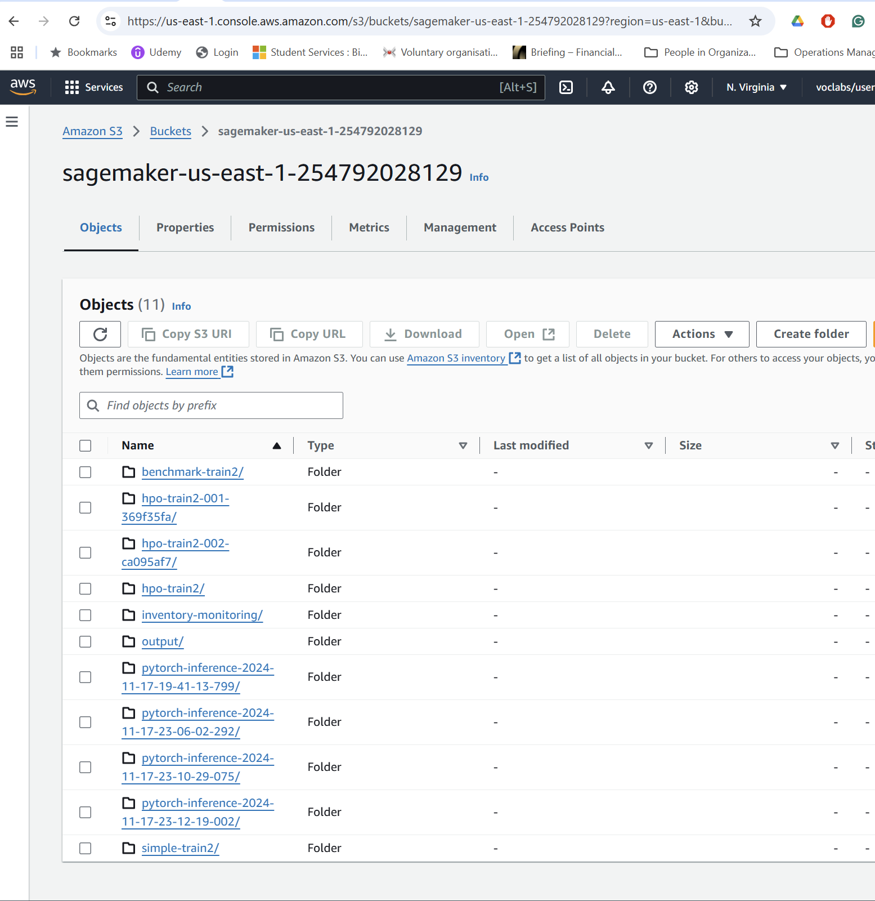

# Automated Bin Image Classification for Inventory Management

This project aims to build a machine learning pipeline that classifies bin images based on the number of objects they contain. This classification task supports automation in inventory tracking at distribution centers, reducing manual effort and increasing operational efficiency. Using three different models—a simple ResNet50-based model, a benchmark ResNet50 model, and a hyperparameter-optimized ResNet50—we compare their performance to identify the most efficient approach.

---

## Project Set Up and Installation

1. **AWS Setup**:
   - Launch an Amazon SageMaker instance.
   - Set up an S3 bucket to store the dataset and model artifacts.
   - Create and configure IAM roles with appropriate permissions.

2. **Dependencies**:
   - Install required libraries such as `torch`, `torchvision`, `scikit-learn`, and `sagemaker`.
   - Use Python 3.8+ for compatibility with SageMaker PyTorch framework.

3. **Directory Structure**:
   - Data is structured in folders named `1`, `2`, `3`, `4`, and `5`, representing the number of objects in bins.
   - Processed data is stored in `processed_data` with subfolders for `train`, `validation`, and `test`.

4. **Project Files**:
   - `train.py`: Used for training the simple model.
   - `benchmark.py`: Used for training the benchmark ResNet50 model.
   - `hpo.py`: Used for hyperparameter tuning with SageMaker.
   - `inference.py`: Inference script for the simple model.
   - `inference_benchmark.py` and `inference_hpo.py`: Inference scripts for the benchmark and HPO models.

Screenshots:
- Data location in S3: 

- Deployed endpoints: 
  

---

## Dataset

### Overview

The **Amazon Bin Image Dataset** contains images of bins from Amazon Fulfillment Centers. Each bin contains a random number of objects (1–5), and metadata is used to label the images based on the `EXPECTED_QUANTITY`.

### Access

1. Data is downloaded and organized into folders (`train_data` and `processed_data`) locally using a provided script.
2. The processed data is uploaded to an AWS S3 bucket for accessibility during training and evaluation in SageMaker.

---

## Model Training

### Models Used

1. **Simple Model**:
   - Based on ResNet50 with a modified fully connected (FC) layer to handle 5 output classes.
   - Fixed hyperparameters:
     - Batch size: 64
     - Learning rate: 0.005
     - Epochs: 5

2. **Benchmark Model**:
   - Standard ResNet50 with only the FC layer updated for 5-class classification.
   - Provides a baseline to evaluate the other models' performance.

3. **Hyperparameter-Optimized Model**:
   - Based on ResNet50 but fine-tuned using SageMaker's HPO framework.
   - Hyperparameter search space:
     - Learning rate: [0.005, 0.05]
     - Batch size: [32, 64]
     - Epochs: [5, 7]
   - Best hyperparameters:
     - Batch size: 64
     - Learning rate: 0.0285
     - Epochs: 5

### Evaluation Metrics

- **Accuracy**: Measures the overall correct predictions.
- **Confusion Matrix**: Identifies class-wise prediction errors.
- **Classification Report**: Provides precision, recall, and F1-score for each class.

### Performance Summary

| Model               | Accuracy | Key Observations                              |
|---------------------|----------|-----------------------------------------------|
| Simple Model        | 28.68%   | Struggles with Class 1 and Class 5 predictions. |
| Benchmark Model     | 27.53%   | Slightly lower accuracy; significant class confusion. |
| HPO Model           | 30.98%   | Best performing model with improved recall for Class 5. |

---

## Machine Learning Pipeline

1. **Data Preparation**:
   - Split into `train`, `validation`, and `test` sets.
   - Preprocessing: Resize to 224x224, normalize with ImageNet mean and std.

2. **Model Training**:
   - Train models on SageMaker using GPU-optimized instances (`ml.p3.2xlarge`).
   - Save the best-performing model to S3 for deployment.

3. **Model Deployment**:
   - Deploy each trained model to separate SageMaker endpoints:
     - `endpoint-simple`: Simple model.
     - `endpoint-resnet`: Benchmark ResNet50 model.
     - `endpoint-hpo`: Hyperparameter-optimized model.

4. **Model Evaluation**:
   - Query endpoints using test data.
   - Compute metrics (accuracy, confusion matrix, and classification report) for each endpoint.

---

## Standout Suggestions

1. **Hyperparameter Tuning**:
   - By fine-tuning parameters such as learning rate, batch size, and number of epochs, the hyperparameter-optimized model (HPO Model) achieved the best performance among the three models. SageMaker's automated hyperparameter tuning identified the optimal combination of parameters, leading to improved recall and accuracy. Please note the aim is not to be accurate.

2. **Model Deploying and Querying**:
   - Each trained model was deployed to dedicated SageMaker endpoints (`endpoint-simple`, `endpoint-resnet`, and `endpoint-hpo`) for real-time inference. This step enables scalable deployment and facilitates live testing with unseen data to validate model performance.

3. **Evaluation Metrics**:
   - Metrics such as accuracy, confusion matrix, and classification report provided a comprehensive view of model performance. These metrics highlighted areas where the models performed well (e.g., high recall for Class 5 in the HPO model) and identified misclassification patterns, guiding future improvements.

## References

1. https://udacity.com
2. https://github.com/awslabs/open-data-docs/tree/main/docs/aft-vbi-pds
3. https://aws.amazon.com/sagemaker/
4. https://pytorch.org/docs/stable/generated/torch.nn.CrossEntropyLoss.html